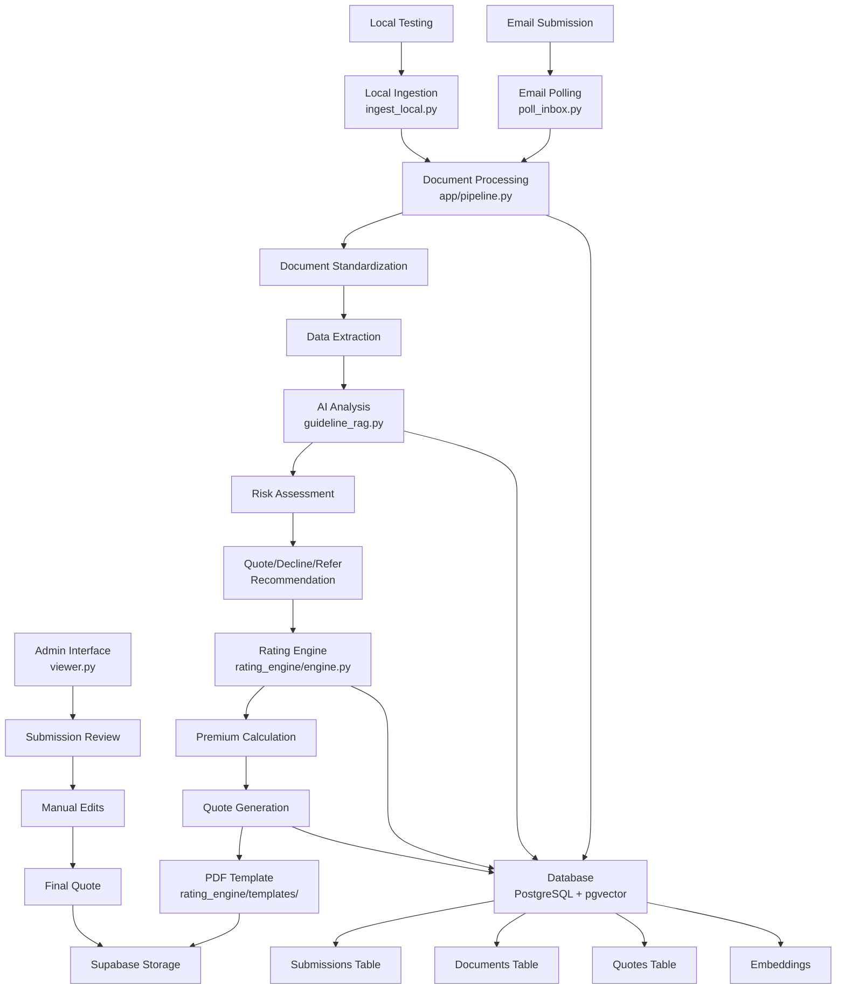

# Process Flow Documentation

## 🔄 System Workflow Diagram



## 📋 Detailed Process Steps

### Phase 1: Submission Reception
**Scripts**: `poll_inbox.py`, `ingest_local.py`

1. **Email Monitoring** (`poll_inbox.py`)
   - Continuously polls email inbox
   - Detects new insurance submissions
   - Extracts email subject, body, and attachments

2. **Local Development** (`ingest_local.py`)
   - Processes local fixture data for testing
   - Reads `email.txt` for subject/body content
   - Loads JSON attachments with type hints

### Phase 2: Document Processing
**Script**: `app/pipeline.py`

3. **Document Parsing**
   - Identifies document types (Application, Loss Run, Other)
   - Extracts text content from various formats
   - Standardizes data structure

4. **Data Extraction**
   - Applicant information (name, website)
   - Annual revenue extraction and storage
   - Business operations summary
   - Security controls assessment
   - Financial and risk data

5. **Database Storage**
   - Saves submission metadata to `submissions` table
   - Stores revenue as separate field for rating calculations
   - Stores document content in `documents` table
   - Generates embeddings for similarity search

### Phase 3: AI Analysis
**Script**: `guideline_rag.py`

6. **Guideline Retrieval**
   - Searches vector database for relevant guidelines
   - Uses RAG (Retrieval Augmented Generation)
   - Finds top 15 most similar guideline chunks

7. **Risk Assessment**
   - Analyzes business operations against guidelines
   - Evaluates security controls effectiveness
   - Identifies potential risk factors

8. **Underwriting Decision**
   - Generates Quote/Decline/Refer recommendation
   - Provides detailed rationale with citations
   - References specific guideline sections

### Phase 4: Rating & Pricing
**Script**: `rating_engine/engine.py`

9. **Risk Classification**
   - Maps industry to hazard class (1-5 scale)
   - Categorizes revenue into bands (<10M, 10M-50M, 50M-250M, >250M)
   - Applies policy limit and retention factors

10. **Premium Calculation**
    - Base rate × revenue × hazard multiplier
    - Applies limit and retention factors
    - Adjusts for security control credits/debits

### Phase 5: Quote Generation
**Scripts**: `viewer.py`, `rating_engine/templates/`

11. **Template Rendering**
    - Uses Jinja2 templates for quote formatting
    - Generates HTML from template data
    - Converts HTML to PDF using WeasyPrint

12. **Storage & Distribution**
    - Uploads PDF to Supabase storage
    - Generates public URLs for access
    - Stores quote metadata in database

### Phase 6: Admin Review
**Script**: `viewer.py`

13. **Submission Review**
    - Displays all submission data in Streamlit interface
    - Shows AI recommendations and ratings
    - Allows manual editing of extracted data

14. **Quote Management**
    - Generates final quotes after review
    - Manages quote versions and updates
    - Tracks approval workflow

## 🔧 Script Dependencies

```
ingest_local.py
├── app/pipeline.py
│   ├── app/db.py
│   ├── OpenAI API
│   └── Tavily API
└── PostgreSQL Database

poll_inbox.py
├── app/pipeline.py
│   ├── app/db.py
│   ├── OpenAI API
│   └── Tavily API
└── PostgreSQL Database

guideline_rag.py
├── Supabase Vector Store
├── OpenAI Embeddings
└── OpenAI Chat API

rating_engine/engine.py
├── YAML Configuration Files
└── Mathematical Calculations

viewer.py
├── Streamlit Framework
├── PostgreSQL Database
├── Supabase Storage
├── rating_engine/engine.py
└── Jinja2 Templates
```

## 📊 Data Flow Between Components

### Database Schema Relationships
```
submissions (id, broker_email, date_received, summary, flags, quote_ready, revenue)
    ↓
documents (id, submission_id, filename, document_type, extracted_data)
    ↓
quotes (id, submission_id, quote_json, pdf_url, created_by)
```

### Vector Embeddings
- **Operations Summary**: 1536-dimensional vectors for business operations
- **Security Controls**: 1536-dimensional vectors for security measures
- **Guideline Chunks**: Vectorized underwriting guidelines for similarity search

### Configuration Files
- **Industry Mapping**: Maps business types to risk levels
- **Rate Tables**: Base rates by hazard class and revenue band
- **Multipliers**: Factors for policy limits and retentions
- **Control Credits**: Security measure adjustments

## 🚀 Execution Order for New Setup

1. **Database Initialization**
   ```bash
   python init_db.py
   python enable_pgvector.py
   python setup_embeddings.py
   ```

2. **Data Loading**
   ```bash
   python scripts/load_guidelines.py
   ```

3. **Testing**
   ```bash
   python ingest_local.py --dir fixtures/acme/
   streamlit run viewer.py
   ```

4. **Production**
   ```bash
   # Set up email polling (configure poll_inbox.py)
   # Run background worker for continuous processing
   ```

## 🔍 Monitoring Points

### Key Metrics to Track
- **Processing Time**: Document ingestion to quote generation
- **Success Rate**: Successful vs. failed submissions
- **AI Accuracy**: Recommendation quality and consistency
- **Database Performance**: Query response times and connection health

### Error Handling
- **Document Parsing Failures**: Log and flag for manual review
- **API Timeouts**: Implement retry logic with exponential backoff
- **Database Connection Issues**: Connection pooling and failover
- **Template Rendering Errors**: Fallback to basic formatting

### Logging Strategy
- **Application Logs**: Processing steps and decisions
- **Error Logs**: Detailed error information with stack traces
- **Performance Logs**: Timing data for optimization
- **Audit Logs**: User actions and data changes
